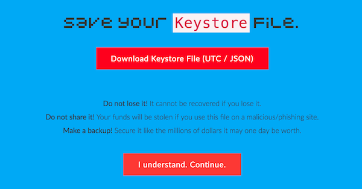
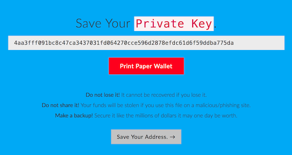

# Pixels Camp Wallet

Our wallet is based on the popular [MyEtherWallet][11] sofware, aka known as Mew. Mew sources can be found [here][12]. Mew is completely static and runs client-side in your web browser, which in turn connects to the Testnet RPC interface.

For convenience you can use our instance here: [https://wallet.pixels.camp/][13].

If you're paranoid, you can download the [static files][14] to your computer, and run it locally. Works the same.

Mew is pretty nice. You can do the following operations with it:

 * Create new wallets
 * Send ether or EXP tokens to other addresses
 * Interact with smart contracts
 * Use ENS (At the time of writing this, we don't have ENS deployed in our Testnet)
 * Check the status of a transaction
 * View your wallet details

## Creating your wallet

Creating a new wallet is really easy. Just go to [https://wallet.pixels.camp/#generate-wallet][15], type a password and press the "Create New Wallet" button.

This password is NOT your private key. It's just an extra level of local security that encrypts your new private key. Remember: all that matters to the network is your private key.

When you click the "Create New Wallet" button, you'll go through two screens.

The first allows you to download a keystore file, which has your private key encrypted with the password you chose. Store it safely. You can use this file to open your wallet later.

The second is your private key. This is the really important part. If you share your private key with anyone, or if it's stolen, then the thief will have full access to your wallet, no password required, and steal your funds and tokens.

The best way to safely store your private is:

 * In a password manager such as [1Password][16], [Lastpass][17] or [pass][18]
 * Printing a paper wallet, and keeping it in a safe vault. Not in your desk!

## Get some Ether

To get 1000 free ethers, you need to update your Pixels Camp user profile.

First open Metamask again, and copy your public Ethereum address to the clipboard.

Now login to your [Pixels Camp account][7] and edit your profile. You'll find a "Moon Wallet" field. Copy your ethereum address and press enter.

Go back to Metamask and watch. In 1-2 minutes your wallet will show that you own 1000 ethers.

You're ready.

## Questions?

Use [Slack][8], channel `#blockchain`. We'll be around.

Back to [Exposure][13]

[1]: https://ethereum.org/
[2]: https://ethereum.org/ether
[3]: http://consensys.github.io/developers/articles/101-noob-intro/
[4]: https://github.com/ethereum/go-ethereum/wiki/Contract-Tutorial
[5]: https://chrome.google.com/webstore/detail/metamask/nkbihfbeogaeaoehlefnkodbefgpgknn
[6]: https://metamask.io/
[7]: https://pixels.camp/
[8]: https://github.com/PixelsCamp/docs/blob/master/SLACK.md
[9]: http://moon.pixels.camp:8547/
[10]: https://github.com/gobitfly/etherchain-light
[11]: https://www.myetherwallet.com/
[12]: https://github.com/kvhnuke/etherwallet
[13]: https://wallet.pixels.camp/
[14]: https://github.com/PixelsCamp/moon/tree/master/wallet
[15]: https://wallet.pixels.camp/#generate-wallet
[16]: https://1password.com/
[17]: https://www.lastpass.com/
[18]: https://www.passwordstore.org/
