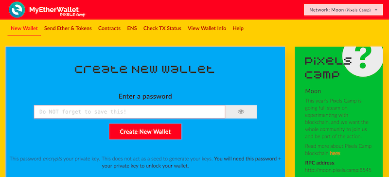
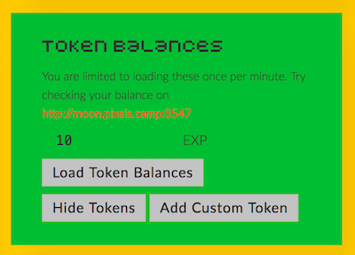
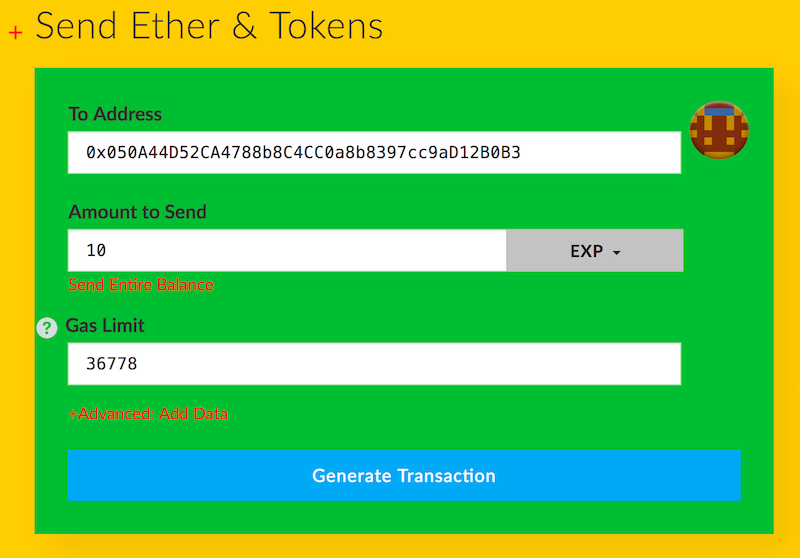

# Pixels Camp Wallet

Our wallet is based on the popular [MyEtherWallet][11] sofware, also known as `Mew`. `Mew` sources can be found [here][12]. `Mew` is completely static and runs client-side in your web browser, which in turn connects to the Testnet RPC interface.

For convenience you can use our instance here: [https://wallet.pixels.camp/][13].

If you're paranoid, you can download the [static files][14] to your computer, and run it locally. Works the same, but you'll get that warm fuzzy feeling that comes with doing your own thing.

`Mew` is pretty nice. You can do the following operations with it:

 * Create new wallets
 * Send ether or `EXP` tokens to other addresses
 * Interact with smart contracts
 * Use ENS (At the time of writing, we don't have ENS deployed in our Testnet)
 * Check the status of a transaction
 * View your wallet details

[][13]

## Creating your wallet

Creating a new wallet is really easy. Just go to [https://wallet.pixels.camp/#generate-wallet][15], type a password and press the "Create New Wallet" button.

This password is NOT your private key. It's just an extra level of local security that encrypts your new private key. Remember: all that matters to the network are the transactions signed with your private key.

When you click the "Create New Wallet" button, you'll go through two screens:

 * The first allows you to download a keystore file, which has your private key encrypted with the password you chose. Store it safely. You can use this file to open your wallet later.

 * The second is your private key. This is the really important part. If you share your private key with anyone, or if it's stolen, then the thief will have full access to your wallet, no password required, and steal your funds and tokens.

The best way to safely store your private key is:

 * Using a password manager such as [1Password][16], [Lastpass][17] or [pass][18]
 * Printing a paper wallet, and keeping it in a safe vault. Not on your desk, or glued to your monitor!

## Get some Ether

To get 1000 free ethers, you need to update your Pixels Camp user profile.

Login to your [Pixels Camp account][7] and edit your profile. You'll find a "Moon Wallet" field. Copy your public wallet address and press enter.

Go back to `Mew` and open your wallet. In 1-2 minutes your account will show that you own 1000 ethers.

You're ready.

## Checking your `EXP` tokens

Our `Mew` is configured to show your `EXP` balance out of the box.

All you need to do is open your wallet with your private key or keystore file [here][19].

## Sending `EXP` tokens to someone else

You can send your `EXP` tokens to any Testnet address.

Testnet addresses are 40 hex characters / 160 bits like this one: `0x050A44D52CA4788b8C4CC0a8b8397cc9aD12B0B3`

They can either belong to a [user][20], a [smart contract][21] or, in the case of Pixels Camp, a [project][22].

Once you know the destination address where to send tokens, then go the "[Send Ether & Tokens][23]" page in `Mew`, enter your private key or keystore file, press the "Load Tokens Balance" button, and then fill out the form with the desired amount of `EXP` you wish to send. Like this:

Then press "Generate Transaction", then "Send Transaction", then confirm the Warning popup, and you're done.

The destination address will receive your `EXPs` in a few seconds, once the network mines a new block.

## Questions?

Use [Slack][8], channel `#blockchain`. We'll be around.

Back to [Exposure][24]

[1]: https://ethereum.org/
[2]: https://ethereum.org/ether
[3]: http://consensys.github.io/developers/articles/101-noob-intro/
[4]: https://github.com/ethereum/go-ethereum/wiki/Contract-Tutorial
[5]: https://chrome.google.com/webstore/detail/metamask/nkbihfbeogaeaoehlefnkodbefgpgknn
[6]: https://metamask.io/
[7]: https://pixels.camp/
[8]: https://github.com/PixelsCamp/docs/blob/master/SLACK.md
[9]: http://moon.pixels.camp:8547/
[10]: https://github.com/gobitfly/etherchain-light
[11]: https://www.myetherwallet.com/
[12]: https://github.com/kvhnuke/etherwallet
[13]: https://wallet.pixels.camp/
[14]: https://github.com/PixelsCamp/moon/tree/master/wallet
[15]: https://wallet.pixels.camp/#generate-wallet
[16]: https://1password.com/
[17]: https://www.lastpass.com/
[18]: https://www.passwordstore.org/
[19]: https://wallet.pixels.camp/#view-wallet-info
[20]: https://pixels.camp/celso
[21]: https://github.com/PixelsCamp/moon/tree/master/contracts
[22]: https://pixels.camp/projects/1
[23]: https://wallet.pixels.camp/#send-transaction
[24]: https://github.com/PixelsCamp/moon

