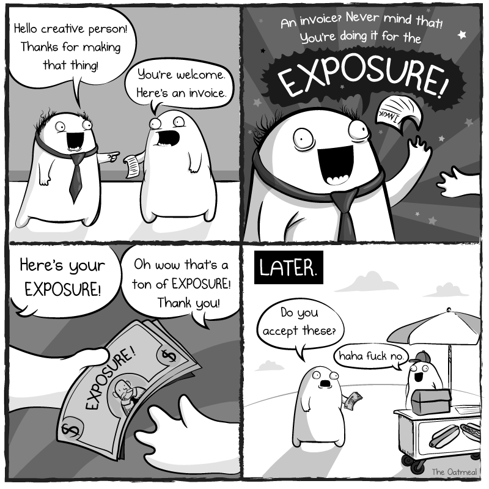

# Exposure

Exposure is an [Ethereum ERC20][1] token specifically created for the Pixels Camp participants. Its primary purpose is to help developers get familiarized with the Ethereum Blockchain technology and to foster experimentation of new ideas and applications on top of it.

Our digital coin can be used with many activities around the Pixels Camp event and community, including investing in the hackathon projects, essencially substituting the voting system, or buying services. You can see a list of uses below. Our goal is to simulate a real life market and a [Nash equilibrium][20] using the Blockchain as the underlying decentralized and transparent platform.

The symbol for Exposure is EXP.

EXP runs on our Ethereum Testnet and is ruled by a smart contract at the address `0x0ce335bb2d04595c84e3d444675360f64de386e8`.

You can interact and inspect the contract [here][8], and sources are [here][9].

The name was inspired by the famous [You're doing it for the exposure][2] cartoon from The Oatmeal.

[][13]

If you don't know The Oatmeal, then you're missing out big time. Go ahead and support [Matthew Inman][16]'s work, check its the [comics][15] and the [shop][14].

## Inital setup

To start using EXP, first, you need to get yourself a wallet. In Ethereum, and most blockchains, the simplest form of a wallet is a public address, which you use to send money/tokens/data to, and a private key, which you should store securely in place no one can access.

Some wallet applications will use passwords or mnemonics to make things easier for you, but that's just convenience. Deep inside their guts, all they're doing is managing your private key to sign transactions for you.

Two things you need to know:

 * The private key generates your public address.
 * Anyone with your private key can access your wallet and steal your money or tokens, and there's nothing you can do about it.

### Creating the wallet

There are many ways to create a wallet, and we're pretty sure that soon you'll be digging into command line python or nodejs code to manage this task, but for the time being, let's keep it simple. Here are two methods, GUI based to create your wallet:

 * Create wallet using the [Pixels Camp Wallet][10] (recommended)
 * Create wallet using the [Metamask][11] Chrome Extension

## Earning EXP tokens

There are 5 ways to earn EXP tokens to your account.

 1. By participating and earning [badges][17]. For each badge you earn, you get EXPs. Each badge equals to 100 EXPs, but some badges are worth more (ex: the quiz show winners).
 1. By convincing other participants to send you their EXPs. We don't interfere here.
 1. By convincing the angels (the new jury) to invest in you or your project.
 1. By selling a service in the [marketplace][21] by which participants pay you for (same as above, basically).
 1. By investing in a winning project, and receiving the dividens at the end.
 1. By solving a very special scavenger hunt we setup for you, and accessing a wealthy pot of EXP. You'll be an EXP whale.

Just remember that in order to earn tokens, first you must setup your account/wallet and then you must put your public address in your profile page. **If you don't do this, then you're out of the market**.

## Spending EXP tokens

You can spend your EXP tokens with:

 1. [Offering them][18] to other participants, for reasons.
 1. Investing in the hackathon [projects][19] you like the most.
 1. Buying services from the [marketplace][21].

## Equilibrium

For the market to work and have liquidity, one must be very careful with the incentives in place. We thought about this for a while and made a few simulations, but to be honest there's a good chance we will be doing it wrong. There's no dangerous place like a place packed with creative technology hackers to deconstruct a model you thought would work... on paper.

But again, this is all a big, fun and educative experiment based on principles of full decentralization and transparency, so even if we blow it, we're also pretty sure you're going to love the process and learn from it, as we will. Furthermore last year our voting platform was... Slack, [so the bar is low][33].

Here are the rules to create incentives for everyone, some of which were mentioned already, and maintain equilibrium:

 1. Each badge equals to 100 EXPs in the participant's account, but some badges are worth more (ex: the quiz show winners).
 1. You can [transfer][18] or accumulate EXPs to and from other [users][30], [smart contracts][31] or [projects][32].
 1. You can buy or sell services using the [marketplace][21].
 1. There is special scavenger hunt in place, that once solved, will make someone rich. ~50000 EXPs rich.
 1. There are about ~20 angels with 25000 EXPs each to invest. This is the new jury.
 1. By the end of the projects presentations (30 minutes later) we will take a full snapshop of the Blockchain and run our scripts on it. The block number used to calculate the final results will be made public.
 1. The 10 projects with more EXP invested on them by then, will win the Pixels Camp hackathon and get the prizes.
 1. The EXPs invested in all the projects will be part of a big pot controlled by the organization.
 1. The investors that put money in the 10 winning projects, including their own team members, will receive all the EXPs in the big pot.
 1. Each winning investor will get a proportion of the total EXPs invested in the project and their personal investment.
 1. This will act as the return of their investment and will hopefully be a good incentive to put EXPs in projects that deserve them. To put in other words, if you invested on a winning project, then you will be rich in the end.
 1. The investors with more EXPs in the end, after the final dividends distribution, will also win prizes and public recognition for their work.

[1]: https://theethereum.wiki/w/index.php/ERC20_Token_Standard
[2]: http://theoatmeal.com/comics/exposure
[3]: https://ens.domains/
[4]: https://pixels.camp/campfire/
[5]: https://github.com/ethereum/web3.js
[6]: https://metamask.io/
[7]: https://github.com/ethereum/mist
[8]: https://wallet.pixels.camp/#contracts
[9]: https://github.com/PixelsCamp/moon/tree/master/contracts
[10]: MEW.md
[11]: METAMASK.md
[13]: http://theoatmeal.com/comics/exposure
[14]: https://shop.theoatmeal.com/
[15]: https://theoatmeal.com/
[16]: https://en.wikipedia.org/wiki/The_Oatmeal
[17]: https://pixels.camp/badges/
[18]: https://github.com/PixelsCamp/moon/blob/master/MEW.md#sending-exp-tokens-to-someone-else
[19]: https://pixels.camp/projects/
[20]: https://en.wikipedia.org/wiki/Nash_equilibrium
[21]: MARKET.md
[30]: https://pixels.camp/celso
[31]: https://github.com/PixelsCamp/moon/tree/master/contracts
[32]: https://pixels.camp/projects/1
[33]: https://youtu.be/yDHg3st_IEk?t=187
