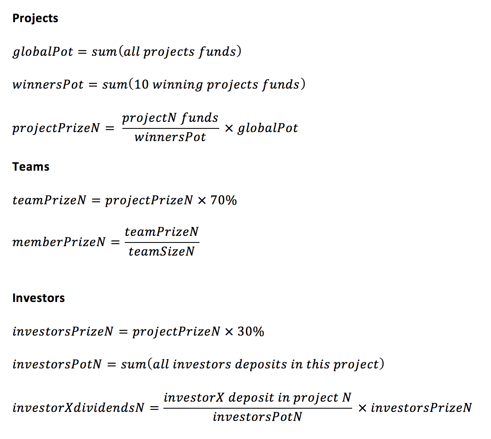

# Exposure

Exposure is an [Ethereum ERC20][1] token specifically created for the Pixels Camp participants. Its primary purpose is to help developers get familiarized with the Ethereum Blockchain technology and to foster experimentation of new ideas and applications on top of it.

Our digital coin can be used with many activities around the Pixels Camp event and community, including investing in  hackathon projects (which is our spanking new replacement for the voting system), or buying services from other projects. You can see a list of suggested uses below, but our ultimate goal (besides world domination) is to simulate a real life marketplace and attain a [Nash equilibrium][20] by leveraging Blockchain as the underlying decentralized and transparent platform.

The symbol for Exposure is `EXP`.

`EXP` runs on our Ethereum Testnet and is ruled by a smart contract at the address `0x0ce335bb2d04595c84e3d444675360f64de386e8`.

You can interact with and inspect the contract [here][8], and sources are [here][9].

The `EXP` name was inspired by the famous [You're doing it for the exposure][2] cartoon from The Oatmeal.

[][13]

If you don't know The Oatmeal, then you're a) probably living in a basement and spending too much time on cryptocurrencies or b) missing out big time. Go ahead and support [Matthew Inman][16]'s work, check out his [comics][15] and the [shop][14].

## Inital setup

To start using `EXP`, you first need to get yourself a wallet. In Ethereum, as well as most blockchains, the simplest form of wallet is a public address, which you use to send money/tokens/data to, and a private key, which you should store securely someplace no one can access.

Some wallet applications will use passwords or mnemonics to make things easier for you, but that's just convenience. Deep inside their guts, all they're doing is managing your private key to sign transactions for you.

Two things you _need_ to know:

 * The private key generates your public address.
 * Anyone with your private key can access your wallet and steal your money or tokens, and there's nothing you can do about it.

### Creating the wallet

There are many ways to create a wallet, and we're pretty sure that soon you'll be [digging][44] into the command line and hacking away using `python` or `nodejs` to manage this task, but for the time being, let's keep it simple. Here are two GUI-based methods to create a wallet without any hassle:

 * Create a wallet using the [Pixels Camp Wallet][10] (recommended)
 * Create a wallet using the [Metamask][11] Chrome Extension

## Earning `EXP` tokens

There are 6 ways to earn `EXP` tokens and get them into your account.

 1. By participating and earning [badges][17]. For each badge you earn, you get `EXP`s. Each badge equals 100 `EXP`s, but some badges are worth more (ex: the quiz show winners).
 1. By convincing other participants to send you their `EXP`s. We don't interfere here - just keep it civil `:)`
 1. By convincing the angels (the new jury) to invest in you or your project.
 1. By selling a service in the [marketplace][21] by which participants pay you for (same as above, basically).
 1. By investing in a winning project, and receiving dividends at the end.
 1. By solving a very special scavenger hunt we are going to set up for you, and accessing a wealthy pot of `EXP`. You'll be an `EXP` whale!

Just remember that in order to earn tokens, first you must setup your account/wallet and then you must put your public address in your profile page. **If you don't do this, then you're out of the market**.

## Spending `EXP` tokens

You can spend your `EXP` tokens by:

 1. [Offering them][18] to other participants, for reasons (again, we won't interfere...)
 1. Investing in the hackathon [projects][19] you like the most.
 1. Buying services from the [marketplace][21].

## Equilibrium

For the market to work and have liquidity, one must be very careful with the incentives in place. We thought about this for a while and made a few simulations, but to be honest there's a good chance we will be doing it wrong. There's no dangerous place like a hackathon packed with top technology wizards to deconstruct a model you thought would work... on paper.

But again, this is all a big, fun and educational experiment based on the principles of full decentralization and transparency, so even if we blow it, we're also pretty sure you're going to love the process and learn from it, just as we will. Furthermore last year our voting platform was... Slack, [so the bar is low][33].

Here are the rules to create incentives for everyone (some of which were mentioned already), and maintain equilibrium:

 1. Each badge equals 100 `EXP`s in the participant's account, but some badges are worth more (ex: the quiz show winners).
 1. You can [transfer][18] or accumulate `EXP`s to and from other [users][30], [smart contracts][31] or [projects][32].
 1. You can buy or sell services using the [marketplace][21].
 1. There is a special scavenger hunt in place that once solved, will make someone rich. ~50000 `EXP`s rich!
 1. There are about ~20 angels with 25000 `EXP`s each to invest. This is the new jury.
 1. The project wallets are owned by Pixels Camp and not by the team that created the project.
 1. All the `EXP`s invested in the projects during the event will stay in their wallets, locked, and can't be used until the end. Think of your project as a crowdfunding campaign.
 1. By the end of the project presentations (30 minutes later) we will take a full snapshop of the Blockchain and run our scripts on it. The block number used to calculate the final results will be made public.
 1. The 10 projects with more `EXP` invested on them by then, will win the Pixels Camp hackathon and get the prizes.
 1. The `EXP`s invested in all the projects will be part of a `big pot` controlled by the organization.
 1. The `big pot` is then divided by the 10 winning projects, in the proportion their funds at count time. For example, if the project 1 had 10x more funds than project 2, then it will receive 10x more from the big pot. Each of the 10 winning projects ends up with a `winning pot`.
 1. The `winning pot` is then divided between 70% for the team members, and 30% for the project investors.
 1. Each investor will get a proportion of the total `EXP`s they invested in the project.
 1. Each team member will get an equal part of the 70% from `winning pot` `EXP`s.
 1. A team member can also be an investor.
 1. This will act as the return of their investment and will hopefully be a good incentive to put `EXP`s in projects that deserve them. To put in other words, if you invested on a winning project, then you will be rich in the end. If not, then you'll lose your `EXP`s.
 1. Team members from losing projects get nothing.
 1. Investors in losing projects lose all their invested `EXP`s.
 1. The participants with more `EXP`s in the end, after the final dividends distribution, will also win prizes and public recognition for their work as entrepeneurs and investors.

Here's a simple simulation with only 2 winning projects (instead of 10, for simplification):

 * At the end of the competition, the sum of all 50 projects funds is **30,000,000** `EXP`s. This is the `big pot`.
 * Winning project number 1 had **200,000** `EXP`s at the time of counting.
 * Winning project number 2 had **100,000** `EXP`s at the time of counting.
 * Project number 1 winning pot will be **20,000,000** `EXP`s.
 * Project number 2 winning pot will be **10,000,000** `EXP`s.
 * Team members from project number 1 will receive **20,000,000** * **70%** = **14,000,000** `EXP`s, divided into equal parts between them.
 * Team members from project number 2 will receive **10,000,000** * **70%** = **7,000,000** `EXP`s, divided into equal parts between them.
 * Investor A invested **50,000** `EXP`s in project 1. He owns **25%** of the investor's pool.
 * Investor A will receive **20,000,000** * **30%** = **6,000,000** `EXP`s * **25%** = **1,500,000** `EXP`s.
 * Investor B invested **10,000** `EXP`s in project 2. He owns **10%** of the investor's pool.
 * Investor B will receive **10,000,000** * **30%** = **3,000,000** `EXP`s * **10%** = **300,000** `EXP`s.

These formulas might help too:

## Tools

Here is a list of tools that will help you navigate through the world of Blockchain:

 * [Pixels Camp Wallet][22], and how to [setup][10] your wallet.
 * [Block explorer][40], based on [Etherchain light][41].
 * [ERC20 explorer][42], source [here][43].
 * [Example scripts][34] and code snippets to get you started with advanced stuff.

## Technical information

Our Testnet runs on Azure, courtesy of Microsoft Portugal. It has 4 nodes, 2 of which are mining (`geths`), and the other 2 are used to expose the RPC interface (`geth`) and support the block explorers (`parity`).

We've tuned the network dificulty to mine new blocks very frequently, every 10 seconds or so.

The RPC interface lives at: `http://moon.pixels.camp:8545`

*Please don't abuse the Testnet with DDoS requests, unnecessary traffic or other possible exploits. This is a big experiment built for the Pixels Camp community to learn and have fun, not for profit and hacking purposes. We know it's tempting, but be cooperative.*

## Technical documentation

If you want to know more about Ethereum, we suggest you start here:

 - [Main website][101]
 - [What is ether][102]
 - [A 101 Noob Intro to Programming Smart Contracts on Ethereum][103]
 - [Contract tutorial][104]

[1]: https://theethereum.wiki/w/index.php/ERC20_Token_Standard
[2]: http://theoatmeal.com/comics/exposure
[3]: https://ens.domains/
[4]: https://pixels.camp/campfire/
[5]: https://github.com/ethereum/web3.js
[6]: https://metamask.io/
[7]: https://github.com/ethereum/mist
[8]: https://wallet.pixels.camp/#contracts
[9]: https://github.com/PixelsCamp/moon/tree/master/contracts
[10]: MEW.md
[11]: METAMASK.md
[13]: http://theoatmeal.com/comics/exposure
[14]: https://shop.theoatmeal.com/
[15]: https://theoatmeal.com/
[16]: https://en.wikipedia.org/wiki/The_Oatmeal
[17]: https://pixels.camp/badges/
[18]: https://github.com/PixelsCamp/moon/blob/master/MEW.md#sending-exp-tokens-to-someone-else
[19]: https://pixels.camp/projects/
[20]: https://en.wikipedia.org/wiki/Nash_equilibrium
[21]: MARKET.md
[22]: https://wallet.pixels.camp
[30]: https://pixels.camp/celso
[31]: https://github.com/PixelsCamp/moon/tree/master/contracts
[32]: https://pixels.camp/projects/1
[33]: https://youtu.be/yDHg3st_IEk?t=187
[34]: https://github.com/PixelsCamp/moon/tree/master/examples
[40]: http://moon.pixels.camp:8547/
[41]: https://github.com/gobitfly/etherchain-light
[42]: http://moon.pixels.camp:8548/
[43]: https://github.com/gobitfly/erc20-explorer
[44]: https://github.com/PixelsCamp/moon/tree/master/examples
[101]: https://ethereum.org/
[102]: https://ethereum.org/ether
[103]: http://consensys.github.io/developers/articles/101-noob-intro/
[104]: https://github.com/ethereum/go-ethereum/wiki/Contract-Tutorial
